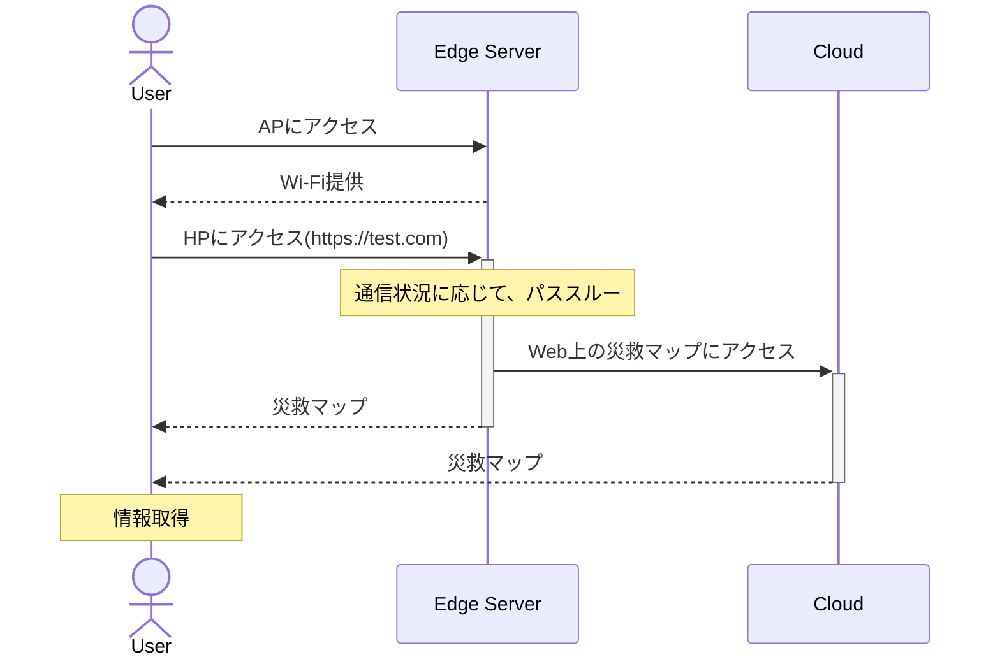

```mermaid
sequenceDiagram
  actor U as User
  participant S as Edge Server
  participant C as Cloud
  U->>S: APにアクセス
  S-->>U: Wi-Fi提供
  U->>+S: HPにアクセス(https://test.com)
  Note over S: 通信状況に応じて、パススルー
  S->>+C: Web上の災救マップにアクセス
  S-->>-U: 災救マップ
  C-->>-U: 災救マップ
  Note over U: 情報取得
```