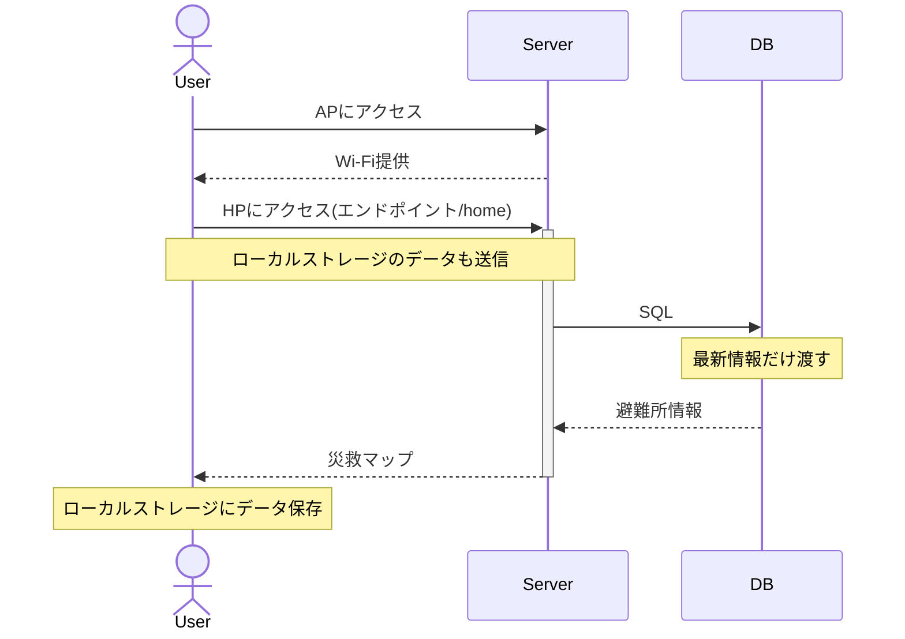

```mermaid
sequenceDiagram
  actor U as User
  participant S as Server
  participant DB
  U->>S: APにアクセス
  S-->>U: Wi-Fi提供
  U->>+S: HPにアクセス(エンドポイント/home)
  Note over U,S: ローカルストレージのデータも送信
  S->>DB: SQL
  Note over DB: 最新情報だけ渡す
  DB-->>S: 避難所情報
  S-->>-U: 災救マップ
  Note over U: ローカルストレージにデータ保存
```
