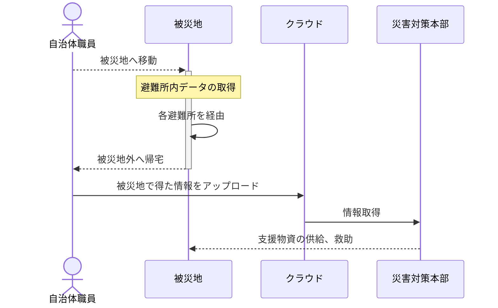

```mermaid
sequenceDiagram
  actor U as 自治体職員
  participant S as 被災地
  participant C as クラウド
  participant Z as 災害対策本部
  U-->>+S: 被災地へ移動
  Note over S:避難所内データの取得
  S->>S:各避難所を経由
  S-->>-U:被災地外へ帰宅
  U->>C:被災地で得た情報をアップロード
  C->>Z:情報取得
  Z-->>S:支援物資の供給、救助
```