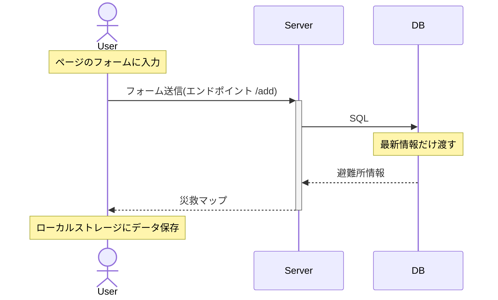

```mermaid
sequenceDiagram
  actor U as User
  participant S as Server
  participant DB
  Note over U: ページのフォームに入力
  U->>+S: フォーム送信(エンドポイント /add)
  S->>DB: SQL
  Note over DB: 最新情報だけ渡す
  DB-->>S: 避難所情報
  S-->>-U: 災救マップ
  Note over U: ローカルストレージにデータ保存
```
Sう