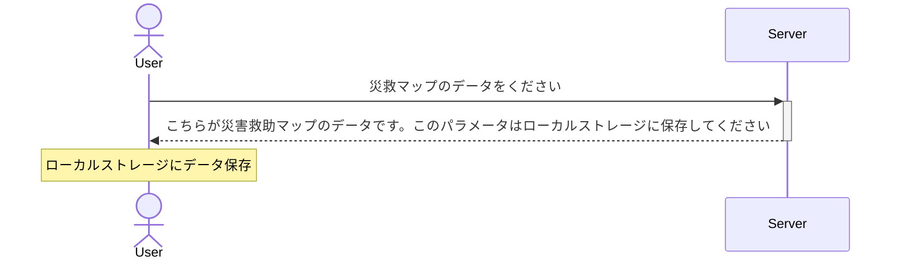
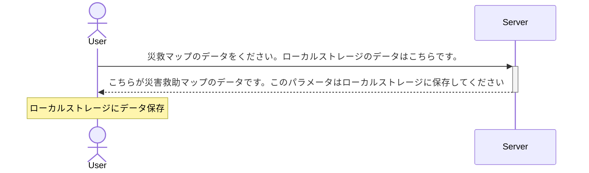

```mermaid
sequenceDiagram
  actor U as User
  participant S as Server
  U->>+S: 災救マップのデータをください
  S-->>-U: こちらが災害救助マップのデータです。このパラメータはローカルストレージに保存してください
  Note over U: ローカルストレージにデータ保存
```

```mermaid
sequenceDiagram
  actor U as User
  participant S as Server
  U->>+S: 災救マップのデータをください。ローカルストレージのデータはこちらです。
  S-->>-U: こちらが災害救助マップのデータです。このパラメータはローカルストレージに保存してください
  Note over U: ローカルストレージにデータ保存
```